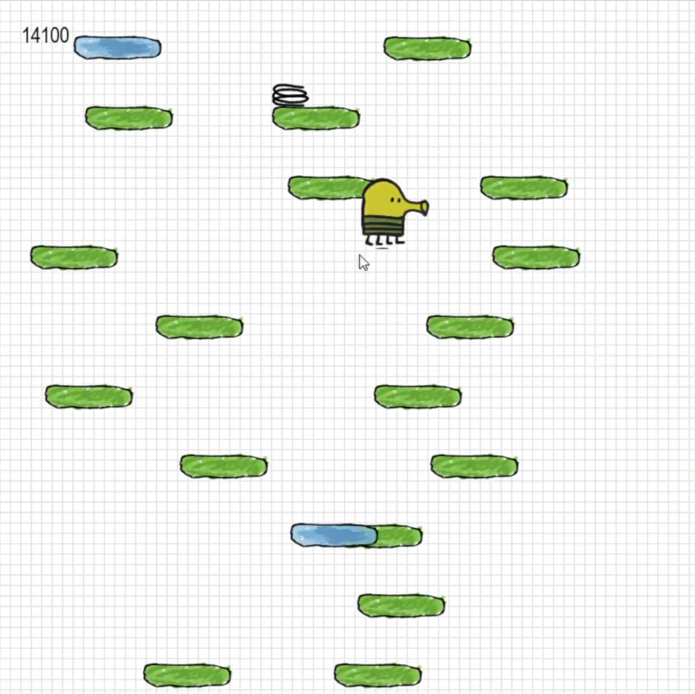
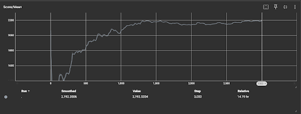
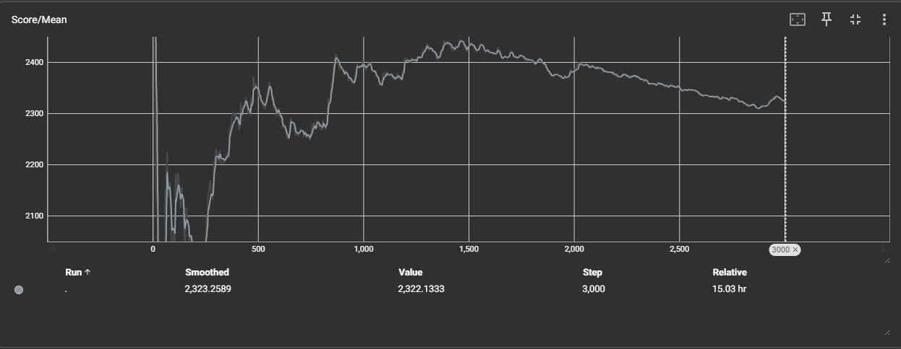
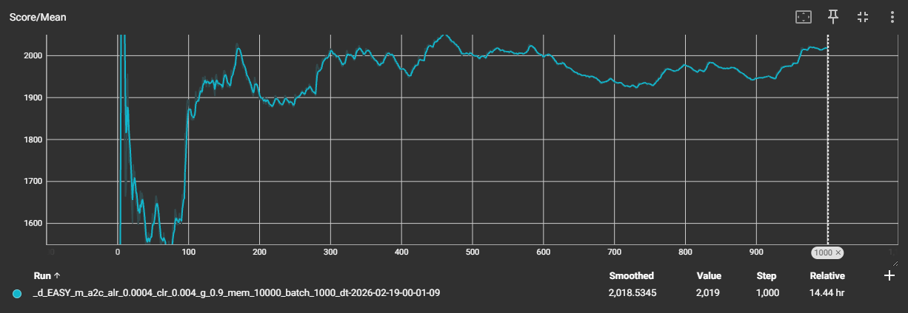
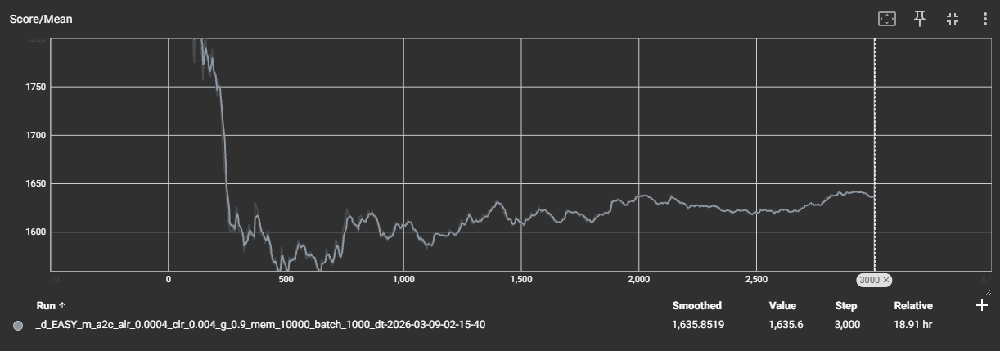
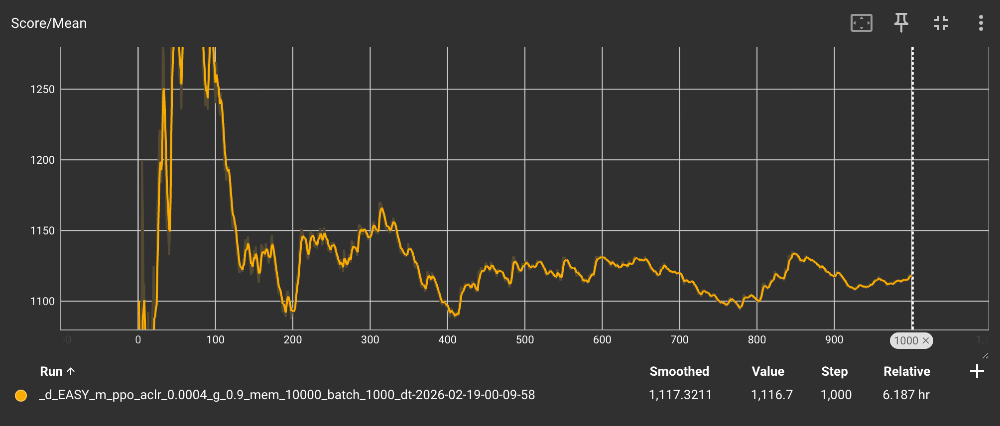

<iframe width="752" height="432" src="https://www.youtube.com/embed/_sAHElX0HlM" title="Doodle or Die - CS 175 - Abheek, Arnav, and Ganeev" frameborder="0" allow="accelerometer; autoplay; clipboard-write; encrypted-media; gyroscope; picture-in-picture; web-share" referrerpolicy="strict-origin-when-cross-origin" allowfullscreen></iframe>

## Project Summary

Our project explores using reinforcement learning to train an agent for Doodle Jump. The goal is to learn a policy that allows the agent to consistently make good progress. The game may seem simple, but between the randomly generated maps and the quick decision making, each action that the Doodler takes is quite crucial to the overall progression. Part of our motivation for this project comes from all of us growing up playing Doodle Jump. We also encountered multiple videos online where agents were trained to play the game using different AI algorithms, and this led us to believe that Doodle Jump would lend itself to reinforcement learning as well. 

Throughout this project, we compared various RL methods including DQN, A2C, and PPO to see how well they survive and how high they progress in Doodle Jump. While building a pipeline for training, we also experimented with tuning hyperparameters and evaluated across many iterations. Ultimately, this gave us insight as to how modern reinforcement learning methods can learn complex tactics even in very simple game settings. 
<figure style="text-align:center;">
  
  <figcaption>Doodle Jump Game Example</figcaption>
</figure>

## Approach

### Environment Setup, States, Actions, and Rewards  

Our game engine was simulated in pygame with both GUI and headless variants. This pre-extant framework was found online as a useful resource for getting up and running with simulation and it contained skeleton models that were preconfigured hyperparameters intended for Doodle Jump.

For our three reinforcement learning algorithms (A2C, PPO, DQN), the Doodle Jump environment provides a set of three actions which include moving left, moving right, or making no movement. At every step, the set of states will include a vector representing the position of the agent, a vector with the velocity of the agent, and a set of the positions of the platforms currently on the screen and their types. Also, springs and monsters are another part of the set of states.  

The environment uses an event driven reward in which the following specific events lead to rewards:  
- +3 if the score increases (progressing to higher platforms)
- +3 for hitting a spring 
- -2 if the agent dies or gets stuck (30 seconds of no progression)
- -4 for colliding with a monster
- 0 for any other case

Currently, each agent is trained for 1,000 game iterations, recording states, actions, and rewards. 

### Deep Q-Network (DQN)  

**Overview**  

Deep Q-Network (DQN) is a value-based reinforcement learning algorithm that learns an action-value function using a neural network. The goal is to approximate the optimal Q-function so the agent can choose actions that maximize expected future rewards. DQN alternates between policy evaluation (updating Q-values using the fitted Q loss) and policy improvement (selecting greedy actions). A greedy strategy is used to maintain exploration. 

The training data consists of $$(s_t, a_t, r_t, s_{t+1}, d_t)$$ where $$s_t$$ is the current state (game frame), $$a_t$$​ is the chosen action (left, right, none), $$r_t$$​ is the reward, $$s_{t+1}$$ is the next state, and $$d_t$$​ indicates whether the current game ended.  

**Data Sampling and Exploration**

DQN is an off-policy method that stores experiences in a replay buffer of size 10,000. During training, mini-batches of 1,000 transitions are sampled uniformly from the buffer. This breaks temporal correlations between consecutive frames and stabilizes learning.  

To balance exploration and exploitation, our agent uses an *ε-greedy* policy:

$$\pi(s) = 
\begin{cases}  
\text{random action}, & \text{with probability } \epsilon \\
\arg\max_a Q(s,a), & \text{otherwise}  
\end{cases}
$$  

Sourced from [CS175 Lecture 2](https://royf.org/crs/CS175/W26/CS175L2.pdf)

This allows the agent to explore new actions while gradually favoring high-value actions. In our case, ε is set to 0.2, so our agent explores a random action 20% of the time.

**Loss Function (Policy Evaluation)**  

During policy evaluation, the network parameters $$\theta$$ are updated by minimizing the *fitted Q loss*:  

$$\mathcal{L}_{\theta}
= \bigl(r_t + \gamma \max_{a'} Q_{\theta}(s_{t+1}, a') - Q_{\theta}(s_t, a_t)\bigr)^2$$  

Sourced from [CS175 Lecture 2](https://royf.org/crs/CS175/W26/CS175L2.pdf)

where:
- $$r_t$$ is the reward received from the environment after the agent takes action $$a_t$$ in state $$s_t$$, stored as part of the transition tuple in the replay buffer
- $$\gamma = 0.9$$ is the discount factor, which controls how much future rewards are weighted relative to immediate rewards. A value of 0.9 means the agent values near-term rewards more heavily but still accounts for long-term consequences
- $$\max_{a'} Q_{\theta}(s_{t+1}, a')$$ is the maximum Q-value predicted by the network over all possible actions in the next state $$s_{t+1}$$, used to bootstrap the TD target
- $$Q_{\theta}(s_t, a_t)$$ is the Q-value predicted by the network for the action $$a_t$$ actually taken in state $$s_t$$
- $$Q_{\theta}(s_t, a_t) - (r_t + \gamma \max_{a'} Q_{\theta}(s_{t+1}, a'))$$ is the temporal-difference (TD) error, representing the gap between the network's current Q-value estimate and the bootstrapped target. The loss minimizes the squared TD error to bring these two values closer together

This loss reduces the temporal-difference error between predicted and target Q-values.

Following our status report, we opted to add a separate target network, $$\theta^{-}$$. The updated loss function is as follows:

$$\mathcal{L}_{\theta}
= \bigl(r_t + \gamma \max_{a'} Q_{\theta^{-}}(s_{t+1}, a') - Q_{\theta}(s_t, a_t)\bigr)^2$$  

Previously, the target was updated continually with each update to the weights. This continuously shifting target sets an unstable baseline. With the target network change, we freeze a copy and sync weights every 10 games so that the model can chase a more stable target. 

<figure style="text-align:center;">
  
  <figcaption>DQN Before Target Network</figcaption>
</figure>

<figure style="text-align:center;">
  
  <figcaption>DQN After Target Network</figcaption>
</figure>

**Policy Improvement**  

After updating the Q-function, the policy is improved by selecting greedy actions:

$$\pi(s) = \text{arg}\max_{a}Q(s,a)$$

This iterative loop of evaluation and improvement corresponds to the process shown in the figure and gradually converges toward an optimal policy.  

DQN learns to estimate long-term rewards for lateral movements, enabling the agent to position itself on platforms while avoiding hazards.

**Hyperparameters**  
- Learning rate: 0.001
- Discount factor $$\gamma$$: 0.9
- Replay buffer size: 10,000
- Batch size: 1,000
- Optimizer: Adam
- Target network sync: every 10 games

All other parameters left at default from [stablebaslines3](https://stable-baselines3.readthedocs.io/en/master/modules/dqn.html)  

Updated parameters sourced from [USC Agent](https://github.com/USC-CSCI527-Spring2021/Doodle-Jump)

### Advantage Actor-Critic (A2C)  

**Overview** 

Advantage Actor–Critic (A2C) combines a policy network (actor) and a value network (critic). The actor learns a stochastic policy that selects actions, while the critic learns a value function that estimates expected future returns. A2C alternates between collecting trajectories using the current policy and updating both networks using advantage estimates.

The training data consists of $$(s_t, a_t, r_t, s_{t+1})$$ where $$s_t$$ is the current state (game frame), $$a_t$$​ is the chosen action (left, right, none), $$r_t$$​ is the reward, $$s_{t+1}$$ is the next state. 

**Data Sampling (Rollouts)**  

Algorithm:
- Initialize $$\pi{\theta}$$ and $$V_{\phi}$$
- repeat
  - Roll out $$\xi$$ ~ $$p_{\theta}$$
  - Update $$\Delta\theta \leftarrow \sum_{t}(R_{\geq t}(\xi) - V_{\phi}(s_t))\Delta_{\theta}log\pi_{\theta}(a_t \mid s_t)$$
  - Descend $$L_{\phi} = \sum_{t}(R_{\geq t}(\xi) - V_{\phi}(s_t))^2$$

Sourced from [CS175 Lecture 2](https://royf.org/crs/CS175/W26/CS175L2.pdf)

Following the algorithm, the agent performs rollouts, meaning training data are sampled using the current policy. In our implementation, the agent collects batches of 1,000 steps per update over 1,000 game iterations.

These rollouts capture sequences of platform landings, vertical progress, and hazard interactions, enabling the agent to learn stable jumping behavior.

**Advantage Estimation and Actor Update**  

The actor is updated using the advantage function:

$$A_t = R_{\geq t}(\xi) - V_{\phi}(s_t)$$

where $$R_{\geq t}(\xi)$$ is the return from time $$t$$ onward.

The policy parameters are updated as:  

$$\Delta\theta \leftarrow \sum_{t}(R_{\geq t}(\xi) - V_{\phi}(s_t))\Delta_{\theta}log\pi_{\theta}(a_t \mid s_t)$$

This update increases the probability of actions that lead to higher-than-expected returns and decreases the probability of poor actions.

**Critic Update (Value Loss)**  

The critic minimizes the squared error between predicted values and returns:

$$L_{\phi} = \sum_{t}(R_{\geq t}(\xi) - V_{\phi}(s_t))^2$$  

This trains the critic to accurately estimate state values, reducing variance in policy updates.

A2C learns smoother, lower-variance policies, which in our experiments led to slower but more stable movements that often keep the agent near the center of the screen.

Following our status report, we realized that our code was using samples from a random buffer to mix prior experience. However, this was not truly replicating the on-policy behavior of A2C. So, we decided to remove the random buffer in our A2C. We correctly began updating the agent by using the rollout method shown above with 1,000 steps.

<figure style="text-align:center;">
  
  <figcaption>A2C With Random Buffer</figcaption>
</figure>

<figure style="text-align:center;">
  
  <figcaption>A2C Without Random Buffer</figcaption>
</figure>

**Policy Decline**  

After making this change, we actually observed a decrease in the mean score dropping from approximately 2000 to around 1600. We anticipate that using the random buffer was allowing the agent to learn better from previous strong gameplay. However, the pure on-policy method that we switched to may have introduced noise because depending on the current experience can be difficult especially in a game like Doodle Jump where the environment may differ vastly between games. 

**Hyperparameters:**
- Actor learning rate: 0.0004
- Critic learning rate: 0.004
- Discount factor $$\gamma$$: 0.9
- Memory buffer: 10,000 steps
- Batch size: 1,000
- Optimizer: RMSprop
- Entropy coefficient: 0.01
- Value loss coefficient: 0.5

All other parameters left at default from [stablebaslines3](https://stable-baselines3.readthedocs.io/en/master/modules/a2c.html)

Updated parameters sourced from [USC Agent](https://github.com/USC-CSCI527-Spring2021/Doodle-Jump)

### Proximal Policy Optimization

**Overview**  

Proximal Policy Optimization (PPO) is a reinforcement learning algorithm that directly optimizes a policy by maximizing expected reward while constraining how much the policy is allowed to change between updates. Similar to A2C, PPO maintains both an actor (policy) and a critic (value function) in a single shared network and learns by interacting with the environment.

The training data consists of $$(s_t, a_t, log\pi(a_t \mid s_t), V_t, r_t, d_t)$$ where: 
- $$s_t$$ is the current state (game frame)
- $$a_t$$​ is the chosen action (left, right, none)
- $$log\pi(a_t \mid s_t)$$ is the log probability of the taken action under the current policy
- $$V_t$$​ is the critic's value estimate
- $$r_t$$​ is the reward, $$s_{t+1}$$ is the next state
- $$d_t$$​ indicates whether the current game ended

PPO is an on-policy method, meaning it learns directly from transitions collected under the current policy. Rather than a large replay buffer, experience is accumulated in a short-term buffer and then the buffer is refreshed with new experience. During policy evaluation, the network parameters θ are updated by maximizing the objective:

$$L^\theta_{\bar{\theta}}(s, a) = \min(\rho^\theta_{\bar{\theta}}(a \mid s) A_{\bar{\theta}}(s, a),\ A_{\bar{\theta}}(s, a) + \mid \epsilon A_{\bar{\theta}}(s, a)  \mid)$$  

Sourced from [CS175 Lecture 2](https://royf.org/crs/CS175/W26/CS175L2.pdf)

where:
- $$\rho^\theta_{\bar{\theta}}(a \mid s) = \frac{\pi_{\bar{\theta}}(a \mid s)}{\pi_{\theta}(a \mid s)}$$ is the probability ratio between the updated policy and the old policy
- $$A_{\bar{\theta}}(s, a)$$ is the advantage estimate, computed using the critic's value estimates and $$\gamma$$ = 0.9, indicating whether the taken action performed better or worse than expected
- $$\epsilon$$ is the clipping threshold that prevents $$\rho$$ from moving beyond $$1 \pm \epsilon$$, removing any incentive for excessively large policy updates that could destabilize training

After each update, the policy is improved by shifting towards actions with positive advantage and away from actions with negative advantage. This is achieved through the actor's output distribution, where the agent samples actions leading to high returns. Then, it is combined with the critic's value estimates in order to slowly combine for policy’s optimal behavior.

<figure style="text-align:center;">
  
  <figcaption>PPO Status Report</figcaption>
</figure>

**Hyperparameters:**  
- Actor & critic learning rate: 0.0004
- Discount factor $$\gamma$$: 0.9
- Memory buffer: 10,000 steps
- Batch size: 1,000
- Optimizer: Adam
- Clip parameter $$\epsilon$$: 0.2
- Value loss coefficient: 0.5
- Entropy coefficient: 0.01
- Number of epochs per update: 4

All other parameters left at default from [stablebaslines3](https://stable-baselines3.readthedocs.io/en/master/modules/ppo.html)

Updated parameters sourced from [USC Agent](https://github.com/USC-CSCI527-Spring2021/Doodle-Jump)

### Hyperparameters Summary  

| Agent | LR Actor | LR Critic | γ | Buffer | Batch | Optimizer | Extra |
|-------|----------|-----------|---|--------|-------|-----------|-------|
| DQN | 0.001 | N/A | 0.9 | 10,000 | 1,000 | Adam | Target network every 1,000 steps, ε-greedy decay 1→0.05 |
| A2C | 0.0004 | 0.004 | 0.9 | 10,000 | 1,000 | RMSprop | Entropy=0.01, Value loss=0.5 |
| PPO | 0.0004 | 0.0004 | 0.9 | 10,000 | 1,000 | Adam | Clip ε=0.2, Entropy=0.01, Value loss=0.5, 4 epochs per update |

## Evaluation

### Quantitative Results

To evaluate our Doodle Jump RL agents, we ran each model for 1,000 game iterations during the status report period and 3,000 game iterations during the final report period and recorded both the mean score and the maximum score achieved. The scores correspond to the total vertical height gained in each round.

(Status Report Results)

| Agent | Mean Score | Maximum Score |
|-------|------------|---------------|
| DQN   | 2,192.4    | 24,600        |
| A2C   | 2,019      | 20,600        |
| PPO   | 1,116.7    | 9,200         |

(Final Report Results)

| Agent | Mean Score | Maximum Score |
|-------|------------|---------------|
| DQN   | 2,323.2    | 28,200        |
| A2C   | 1,635.6    | 18,000        |
| PPO   | 1,116.7    | 9,200         |

From these results, we observed that both the DQN and A2C agents learned effective strategies, consistently achieving mean scores above 2,000. DQN showed the highest maximum and mean score, indicating its ability to occasionally exploit long sequences of favorable platform positions. It also improved slightly from our status report to our final report with the adjustment of adding a separate target network. A2C achieved a slightly lower mean and also a slightly lower maximum score. As mentioned earlier, our A2C agent did decline due to our switch to use no random buffer. However, it largely exhibited the same conservative behavior, which stabilized the mean performance but limits high scores. On the other hand, the aggressive behavior of PPO towards edges caused it to achieve much lower scores on average and a much lower maximum score. Due to this, we decided not to focus on PPO following our status report.

### Qualitative Observations  

Beyond numerical performance, we also observed differences in agent *behavior* during gameplay:
- DQN: 
  - At status report: Often continues moving in a single direction for extended periods. This strategy sometimes allows it to reach very high scores if platforms align favorably but can also lead to falls in less favorable sequences. It also causes the agent to get stuck in loops while continuing to jump on the same platforms. 
  - After changes: Displays a more intelligent-looking gameplay with decision making based on the platforms surrounding it. Instead of mindless, one-directional movement, it tends towards nearby platforms and exploring off-screen to the other side when out of options. 
- A2C: 
  - At status report: Moves slowly and favors the center of the screen. This conservative policy results in relatively stable mean scores but lower maximum scores, as the agent rarely chooses riskier lateral movements. Also, this leads to the agent falling off cliffs occasionally due to not moving fast enough to reach platforms. 
  - After changes: Mostly showing the same behavior as from the status report. However, the agent tends to make more questionable decisions, more commonly falling off cliffs and gravitating towards edges. Furthermore, it really struggles to achieve high scores due to being overly conservative and then making a few unfavorable decisions. 
- PPO: Balances between central and side positions with medium-speed movements. This strategy produces lower maximum scores while also lowering mean performance showing the ineffectiveness of the clipped policy updates and entropy-driven exploration.

## What We Could Have Done Better

Our current updated prototype trains DQN and A2C, but can be improved further. The evaluation is currently limited to mean and maximum scores over the course of the game. We have yet to conduct deeper analysis with learning curves and studies by tuning different hyperparameters. We also plan to compare our agents against a baseline heuristic based agent which we will create to follow specific rules and constraints. Also, we would like to train and test with the medium and hard levels because we currently have focused on the easy level. We also aim to perform a grid search with different hyperparameter combinations. As of now, we have enabled training locally on CPU in order to allow us to train with no time constraints and tune hyperparameters freely.  

At the time of our status report, we anticipated several challenges including issues when scaling to the medium and hard levels. Another challenge included ensuring that each algorithm would train for similar amounts of time because different sets of hyperparameters can cause huge differences in training time. Lastly, the challenge of time was a large one, as training was quite time consuming and limited time along with limited GPU hours would be a constraint. As of the final report, we unfortunately did not have the time to scale to the medium and hard levels as we had to focus on bettering our scores on the easy level first. Overall, we made sure that our DQN and A2C policies trained for similar times. Also, being able to train locally on CPU allowed us to train a lot on our local machines and gain more confidence prior to training on the GPU hours. 

We have identified that a potential issue may have been reaching local optima in training that discourages the agent from regressing in order to find further optimizable behaviours. We think it would be worthwhile to research methods of encouraging the exploration of new behaviours across long training runs, even if it means periods of impaired performance.

## Resources Used
- [CS175 Week 2 Lecture Slides](https://royf.org/crs/CS175/W26/CS175L2.pdf): This week's lecture slides provided us with detailed equations and descriptions of all the policies we used - DQN, A2C, and PPO. This gave us a comprehensive way to understand the framework code we were using.  
- [USC Agent](https://github.com/USC-CSCI527-Spring2021/Doodle-Jump/tree/master): This skeleton repository from an existing Doodle Jump RL project served as an excellent starting point to gain access to a simulation engine with agent/reward systems built in. We were able to iterate off of this to train multiple policy agents.
- [StableBaselines3 Documentation](https://stable-baselines3.readthedocs.io/en/master/index.html): This is where we found the default hyperparameters for each of the policies that we used.
- [DoodleJump AI Youtube Video](youtube.com/watch?v=DQR2AmOSm4c&feature=youtu.be): In this video, the creator used genetic algorithms to create an AI Doodle Jump player. This was our inspiration to do this project using RL.
- Generative AI: We used generative AI (Claude AI) to help us understand equations and impact of specific hyperparameters in our policies. It was also used to troubleshoot specific bugs like augmenting code to run on CPU on our local machines. In the later half of the project, we used AI tools to try to identify points in code that could be improved to more closely match existing guidelines for DQN and A2C, as well as to find potential issues in our code that may have hindered performance.

